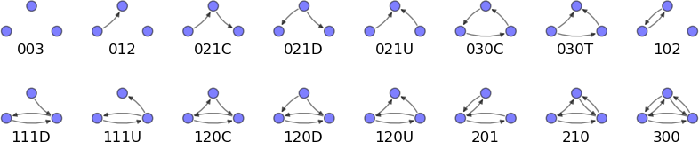
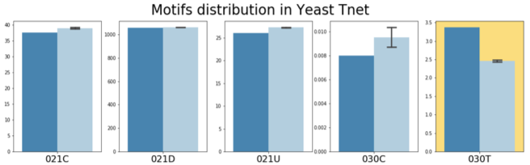
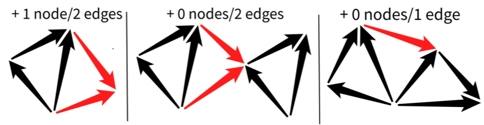

# bionetworks
Materials for semester project in Bioinformatics Institute (spring 2021)

## Building gene regulatory networks with structural properties
### Abstract
Gene regulatory network (GRN) is the model which is used for the description of gene expression levels complex interconnection on the whole-organism scale. It is represented as a graph that can be inferred from expression data, but the inference quality can not be properly assessed without known true structure which is the case in most real-world tasks. The answer is to challenge inference algorithms by artificial expression data generated from the random but still plausible simulated network.

In this work, the original network generation algorithm was implemented using Python. The algorithm was designed to capture the main local structural features of the real GRNs: 1) feed-forward loops (FFL) abundance comparing with randomized networks of the same structure; 2) vertex-based FFL network is the connected graph. Addressing these properties, at the first stage of generation, the whole FFL is attached until a predefined network size is reached. The classic preferential attachment algorithm is employed for network finishing afterwards. The resulting artificial GRN has a motif number distribution similar to the real GRNs' ones and captures the specific high FFL abundance. One is able to tune the size and sparsity of generated network using parameters.
### Objective
Random but plausible (in sense of local structure) artificial gene regulatory network (GRN) generation 
### Plan
1. Investigate real well-validated GRNs local structure
2. Implement generation algorithm

### Content
__1_network_construction.ipynb__ - script converting raw data about network to binary matrix. Resulting matricies are stored in __networks__ folder in .gz format

__2.1_motif_search_algo.ipynb__ - launching motif search pipeline on diffent networks

__2.2_motif_search_vis.ipynb__ - visualization of search results

__3.1_enrichment_prep.ipynb__ - test shuffling, QA and optimal swaps number estimation

__3.2_enrichment_analysis.ipynb__ - main results for enrichment analysis: plots, p-values and Z-scores

__4_generation.ipynb__ - network generation algorithm

